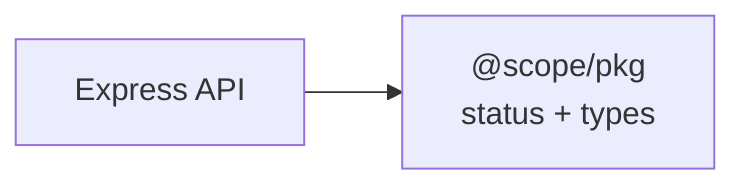

# Mermaid Doc Guard

Validate Mermaid diagrams in markdown files and apply syntax-safe authoring patterns to prevent parser failures.

## Workflow

### 1. Run validation

Find the validation script and run it against the target path (defaults to `docs`):

```bash
SKILL_SCRIPT="$(find ~/.claude/plugins -name 'validate-mermaid.mjs' -path '*/mermaid-doc-guard/*' 2>/dev/null | head -1)"
node "$SKILL_SCRIPT" docs
```

To validate a single file:
```bash
SKILL_SCRIPT="$(find ~/.claude/plugins -name 'validate-mermaid.mjs' -path '*/mermaid-doc-guard/*' 2>/dev/null | head -1)"
node "$SKILL_SCRIPT" path/to/file.md
```

### 2. Fix reported failures

If validation fails, open the referenced file, locate the failing Mermaid block (by its index), and apply the safe authoring patterns below.

### 3. Apply safe Mermaid authoring patterns

- Use explicit node IDs with quoted labels: `id["Label"]`
- Quote labels that contain special characters: `@`, `/`, `:`, `#`, `{`, `}`, `[`, `]`, `<`, `>`, `|`
- Use `<br/>` instead of `\n` inside labels for cross-renderer compatibility
- Keep edge labels quoted when they include punctuation

### 4. Re-validate until all diagrams pass

Re-run the validation script and repeat fixes until exit code is 0.

## Common Repair Example

**Before (broken):**
```mermaid
flowchart LR
  API --> Shared[@scope/pkg\nstatus + types]
```

**After (fixed):**


## Additional Patterns

Read `references/mermaid-safe-patterns.md` for a full reference of safe authoring patterns and characters that require quoting.
